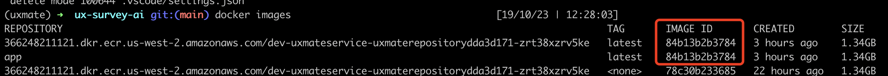
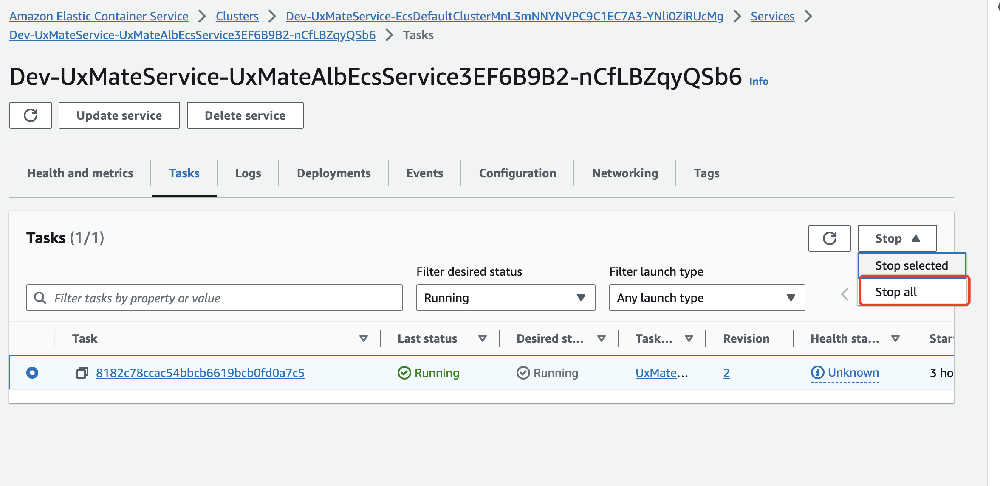

# Backend

## How to launch server using Docker
1. Install docker 
2. Build docker image `docker build -t app .`
3. Run docker `docker run -p 8000:8000 app`
4. Expect output like 
```
INFO:     Started server process [1]
INFO:     Waiting for application startup.
INFO:     Application startup complete.
INFO:     Uvicorn running on http://0.0.0.0:8000 (Press CTRL+C to quit)
```

## Execute it directly
1. Make sure python 3.11 is installed `python --version`
2. Create env `python -m venv uxmate-be` and activate `source uxmate-be/bin/activate`
3. Install dependencies `pip install -r requirements.txt`
4. Launch server `uvicorn main:app --reload`


## Execute the test 
To execute the test use command like this:
    `pytest main_test.py::<test name> -s`
For example:
    `pytest main_test.py::test_end_2_end_happy_path -s`


## How to deploy to server
disclaimer: right now is a bit manual. but this will be fixed once i got some time - Sam 
Deployment to server takes 2 big steps step 1. build the docker images locally and push it to our image repository. Step 2. terminate currently running tasks and new task will be automatically be deployed in couple min. 
1. docker image build and push 
   1. Run docker build command to build a new image
      1. `docker buildx build --no-cache --builder app-linux --platform linux/amd64 -t app:latest . --load` Since most of our local environment will be different, we need to build that for the linux environment
   2. Get the image id you just build
      1. `docker images`
      2. 
      3. see the column from "image id"
      4. copy the one you just built
   3. login to get a session 
      1. `aws ecr get-login-password --region us-west-2 | docker login --username AWS --password-stdin 366248211121.dkr.ecr.us-west-2.amazonaws.com`
   4. tag the image 
      1. `docker tag  <image id>  366248211121.dkr.ecr.us-west-2.amazonaws.com/dev-uxmateservice-uxmaterepositorydda3d171-zrt38xzrv5ke`
   5. push the image 
      1. `docker push 366248211121.dkr.ecr.us-west-2.amazonaws.com/dev-uxmateservice-uxmaterepositorydda3d171-zrt38xzrv5ke`
2. login and stop the current running task
   1. got to [link](https://us-west-2.console.aws.amazon.com/ecs/v2/clusters/Dev-UxMateService-EcsDefaultClusterMnL3mNNYNVPC9C1EC7A3-YNli0ZiRUcMg/services/Dev-UxMateService-UxMateAlbEcsService3EF6B9B2-nCfLBZqyQSb6/tasks?region=us-west-2)
   2. it might ask you to login first. so do that.
   3. 
   4. hopefully you should see something similar. click on stop all. 
   5. now just wait for couple min
3. It's a bit hard to keep track of the version so what i do is just update the version number on the root endpoint of the server and just check that by go to https://ux-mate-api.portal.ai/. So make sure to update the version number of even your own cute thing and make sure you see that new bit of info on that page
